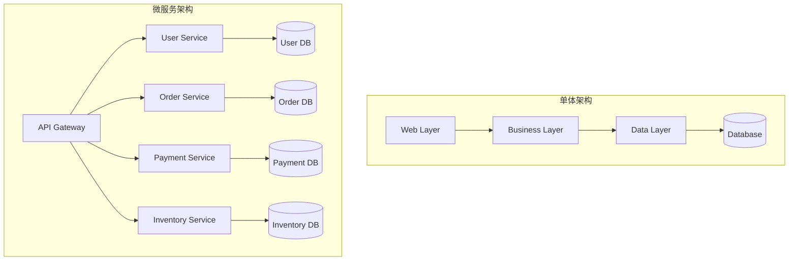

在现代软件开发中，微服务架构已成为构建大规模、高可用系统的主流选择。它将复杂的单体应用拆分为多个独立的服务，每个服务专注于特定的业务功能。

## 微服务架构概述

### 核心特征
1. **业务能力导向**：每个服务围绕业务能力构建
2. **去中心化治理**：服务自主决策技术栈和数据存储
3. **故障隔离**：单个服务的故障不会影响整个系统
4. **独立部署**：服务可以独立开发、测试和部署

### 架构对比



## 服务拆分策略

### 领域驱动设计 (DDD)
```javascript
// 用户领域服务
class UserService {
  constructor(userRepository, eventBus) {
    this.userRepository = userRepository;
    this.eventBus = eventBus;
  }
  
  async createUser(userData) {
    // 业务逻辑验证
    const user = new User(userData);
    await user.validate();
    
    // 保存用户
    const savedUser = await this.userRepository.save(user);
    
    // 发布领域事件
    await this.eventBus.publish(new UserCreatedEvent(savedUser));
    
    return savedUser;
  }
  
  async updateUserProfile(userId, profileData) {
    const user = await this.userRepository.findById(userId);
    if (!user) {
      throw new UserNotFoundError(userId);
    }
    
    user.updateProfile(profileData);
    await this.userRepository.save(user);
    
    await this.eventBus.publish(new UserProfileUpdatedEvent(user));
    
    return user;
  }
}

// 订单领域服务
class OrderService {
  constructor(orderRepository, inventoryService, paymentService, eventBus) {
    this.orderRepository = orderRepository;
    this.inventoryService = inventoryService;
    this.paymentService = paymentService;
    this.eventBus = eventBus;
  }
  
  async createOrder(orderData) {
    // 检查库存
    const inventoryCheck = await this.inventoryService.checkAvailability(
      orderData.items
    );
    
    if (!inventoryCheck.available) {
      throw new InsufficientInventoryError(inventoryCheck.unavailableItems);
    }
    
    // 创建订单
    const order = new Order(orderData);
    const savedOrder = await this.orderRepository.save(order);
    
    // 发布订单创建事件
    await this.eventBus.publish(new OrderCreatedEvent(savedOrder));
    
    return savedOrder;
  }
}
```

### 数据库拆分模式
```sql
-- 用户服务数据库
CREATE DATABASE user_service;
USE user_service;

CREATE TABLE users (
    id VARCHAR(36) PRIMARY KEY,
    email VARCHAR(255) UNIQUE NOT NULL,
    username VARCHAR(100) UNIQUE NOT NULL,
    password_hash VARCHAR(255) NOT NULL,
    profile JSON,
    created_at TIMESTAMP DEFAULT CURRENT_TIMESTAMP,
    updated_at TIMESTAMP DEFAULT CURRENT_TIMESTAMP ON UPDATE CURRENT_TIMESTAMP
);

-- 订单服务数据库
CREATE DATABASE order_service;
USE order_service;

CREATE TABLE orders (
    id VARCHAR(36) PRIMARY KEY,
    user_id VARCHAR(36) NOT NULL, -- 外部引用
    status ENUM('pending', 'confirmed', 'shipped', 'delivered', 'cancelled'),
    total_amount DECIMAL(10,2) NOT NULL,
    items JSON NOT NULL,
    created_at TIMESTAMP DEFAULT CURRENT_TIMESTAMP,
    updated_at TIMESTAMP DEFAULT CURRENT_TIMESTAMP ON UPDATE CURRENT_TIMESTAMP
);

CREATE TABLE order_events (
    id VARCHAR(36) PRIMARY KEY,
    order_id VARCHAR(36) NOT NULL,
    event_type VARCHAR(50) NOT NULL,
    event_data JSON,
    created_at TIMESTAMP DEFAULT CURRENT_TIMESTAMP,
    FOREIGN KEY (order_id) REFERENCES orders(id)
);
```

## 服务间通信

### 同步通信：REST API
```javascript
// API Gateway 路由配置
const express = require('express');
const httpProxy = require('http-proxy-middleware');

const app = express();

// 服务发现配置
const services = {
  user: 'http://user-service:3001',
  order: 'http://order-service:3002',
  payment: 'http://payment-service:3003',
  inventory: 'http://inventory-service:3004'
};

// 代理配置
Object.keys(services).forEach(service => {
  app.use(`/api/${service}`, httpProxy({
    target: services[service],
    changeOrigin: true,
    pathRewrite: {
      [`^/api/${service}`]: ''
    },
    onError: (err, req, res) => {
      console.error(`Proxy error for ${service}:`, err);
      res.status(503).json({ error: 'Service temporarily unavailable' });
    }
  }));
});

// 健康检查
app.get('/health', async (req, res) => {
  const healthChecks = await Promise.allSettled(
    Object.entries(services).map(async ([name, url]) => {
      const response = await fetch(`${url}/health`);
      return { service: name, status: response.ok ? 'healthy' : 'unhealthy' };
    })
  );
  
  res.json({
    status: 'ok',
    services: healthChecks.map(check => check.value)
  });
});
```

### 异步通信：消息队列
```javascript
// 事件总线实现 (使用 RabbitMQ)
const amqp = require('amqplib');

class EventBus {
  constructor() {
    this.connection = null;
    this.channel = null;
  }
  
  async connect() {
    this.connection = await amqp.connect(process.env.RABBITMQ_URL);
    this.channel = await this.connection.createChannel();
    
    // 声明交换机
    await this.channel.assertExchange('domain_events', 'topic', {
      durable: true
    });
  }
  
  async publish(event) {
    const routingKey = `${event.aggregateType}.${event.eventType}`;
    const message = Buffer.from(JSON.stringify({
      ...event,
      timestamp: new Date().toISOString(),
      id: generateEventId()
    }));
    
    await this.channel.publish('domain_events', routingKey, message, {
      persistent: true,
      messageId: event.id
    });
    
    console.log(`Published event: ${routingKey}`);
  }
  
  async subscribe(pattern, handler) {
    const queue = await this.channel.assertQueue('', { exclusive: true });
    
    await this.channel.bindQueue(queue.queue, 'domain_events', pattern);
    
    await this.channel.consume(queue.queue, async (msg) => {
      if (msg) {
        try {
          const event = JSON.parse(msg.content.toString());
          await handler(event);
          this.channel.ack(msg);
        } catch (error) {
          console.error('Event handling error:', error);
          this.channel.nack(msg, false, false); // 拒绝消息，不重新入队
        }
      }
    });
  }
}

// 事件处理器
class OrderEventHandler {
  constructor(inventoryService, emailService) {
    this.inventoryService = inventoryService;
    this.emailService = emailService;
  }
  
  async handleOrderCreated(event) {
    const { orderId, userId, items } = event.data;
    
    try {
      // 预留库存
      await this.inventoryService.reserveItems(orderId, items);
      
      // 发送确认邮件
      await this.emailService.sendOrderConfirmation(userId, orderId);
      
      console.log(`Order ${orderId} processed successfully`);
    } catch (error) {
      console.error(`Failed to process order ${orderId}:`, error);
      // 发布补偿事件
      await this.eventBus.publish(new OrderProcessingFailedEvent({
        orderId,
        reason: error.message
      }));
    }
  }
}

// 使用示例
const eventBus = new EventBus();
const orderHandler = new OrderEventHandler(inventoryService, emailService);

await eventBus.connect();
await eventBus.subscribe('order.*', (event) => {
  switch (event.eventType) {
    case 'created':
      return orderHandler.handleOrderCreated(event);
    default:
      console.log(`Unhandled event type: ${event.eventType}`);
  }
});
```

## 数据一致性

### Saga 模式实现
```javascript
// Saga 编排器
class OrderSaga {
  constructor(services, eventBus) {
    this.userService = services.user;
    this.inventoryService = services.inventory;
    this.paymentService = services.payment;
    this.orderService = services.order;
    this.eventBus = eventBus;
  }
  
  async executeOrderCreation(orderData) {
    const sagaId = generateSagaId();
    const steps = [];
    
    try {
      // 步骤 1: 验证用户
      console.log(`[${sagaId}] Step 1: Validating user`);
      const user = await this.userService.validateUser(orderData.userId);
      steps.push({ step: 'validateUser', data: { userId: user.id } });
      
      // 步骤 2: 预留库存
      console.log(`[${sagaId}] Step 2: Reserving inventory`);
      const reservation = await this.inventoryService.reserveItems(
        sagaId, 
        orderData.items
      );
      steps.push({ step: 'reserveInventory', data: reservation });
      
      // 步骤 3: 处理支付
      console.log(`[${sagaId}] Step 3: Processing payment`);
      const payment = await this.paymentService.processPayment({
        userId: orderData.userId,
        amount: orderData.totalAmount,
        sagaId
      });
      steps.push({ step: 'processPayment', data: payment });
      
      // 步骤 4: 创建订单
      console.log(`[${sagaId}] Step 4: Creating order`);
      const order = await this.orderService.createOrder({
        ...orderData,
        paymentId: payment.id,
        reservationId: reservation.id,
        sagaId
      });
      steps.push({ step: 'createOrder', data: order });
      
      // 步骤 5: 确认库存
      console.log(`[${sagaId}] Step 5: Confirming inventory`);
      await this.inventoryService.confirmReservation(reservation.id);
      
      console.log(`[${sagaId}] Saga completed successfully`);
      return order;
      
    } catch (error) {
      console.error(`[${sagaId}] Saga failed:`, error);
      await this.compensate(sagaId, steps);
      throw error;
    }
  }
  
  async compensate(sagaId, completedSteps) {
    console.log(`[${sagaId}] Starting compensation`);
    
    // 逆序执行补偿操作
    for (let i = completedSteps.length - 1; i >= 0; i--) {
      const step = completedSteps[i];
      
      try {
        switch (step.step) {
          case 'createOrder':
            await this.orderService.cancelOrder(step.data.id);
            break;
          case 'processPayment':
            await this.paymentService.refundPayment(step.data.id);
            break;
          case 'reserveInventory':
            await this.inventoryService.releaseReservation(step.data.id);
            break;
        }
        console.log(`[${sagaId}] Compensated step: ${step.step}`);
      } catch (compensationError) {
        console.error(`[${sagaId}] Compensation failed for ${step.step}:`, compensationError);
        // 记录补偿失败，可能需要人工干预
      }
    }
  }
}
```

### 事件溯源 (Event Sourcing)
```javascript
// 事件存储
class EventStore {
  constructor(database) {
    this.db = database;
  }
  
  async saveEvents(aggregateId, events, expectedVersion) {
    const transaction = await this.db.beginTransaction();
    
    try {
      // 检查版本冲突
      const currentVersion = await this.getAggregateVersion(aggregateId);
      if (currentVersion !== expectedVersion) {
        throw new ConcurrencyError('Aggregate version mismatch');
      }
      
      // 保存事件
      for (let i = 0; i < events.length; i++) {
        const event = {
          ...events[i],
          aggregateId,
          version: expectedVersion + i + 1,
          timestamp: new Date(),
          id: generateEventId()
        };
        
        await this.db.query(
          'INSERT INTO events (id, aggregate_id, event_type, event_data, version, timestamp) VALUES (?, ?, ?, ?, ?, ?)',
          [event.id, event.aggregateId, event.eventType, JSON.stringify(event.data), event.version, event.timestamp]
        );
      }
      
      await transaction.commit();
      
      // 发布事件到消息总线
      for (const event of events) {
        await this.eventBus.publish(event);
      }
      
    } catch (error) {
      await transaction.rollback();
      throw error;
    }
  }
  
  async getEvents(aggregateId, fromVersion = 0) {
    const rows = await this.db.query(
      'SELECT * FROM events WHERE aggregate_id = ? AND version > ? ORDER BY version',
      [aggregateId, fromVersion]
    );
    
    return rows.map(row => ({
      ...row,
      data: JSON.parse(row.event_data)
    }));
  }
}

// 聚合根基类
class AggregateRoot {
  constructor() {
    this.id = null;
    this.version = 0;
    this.uncommittedEvents = [];
  }
  
  applyEvent(event) {
    const handler = this[`on${event.eventType}`];
    if (handler) {
      handler.call(this, event.data);
    }
    this.version++;
  }
  
  raiseEvent(eventType, data) {
    const event = {
      eventType,
      data,
      aggregateType: this.constructor.name
    };
    
    this.applyEvent(event);
    this.uncommittedEvents.push(event);
  }
  
  getUncommittedEvents() {
    return this.uncommittedEvents;
  }
  
  markEventsAsCommitted() {
    this.uncommittedEvents = [];
  }
  
  static fromHistory(events) {
    const aggregate = new this();
    events.forEach(event => aggregate.applyEvent(event));
    return aggregate;
  }
}

// 订单聚合
class Order extends AggregateRoot {
  constructor() {
    super();
    this.status = 'pending';
    this.items = [];
    this.totalAmount = 0;
  }
  
  create(orderData) {
    this.raiseEvent('OrderCreated', {
      orderId: orderData.id,
      userId: orderData.userId,
      items: orderData.items,
      totalAmount: orderData.totalAmount
    });
  }
  
  confirm() {
    if (this.status !== 'pending') {
      throw new Error('Order cannot be confirmed');
    }
    
    this.raiseEvent('OrderConfirmed', {
      orderId: this.id
    });
  }
  
  cancel(reason) {
    if (this.status === 'delivered') {
      throw new Error('Delivered order cannot be cancelled');
    }
    
    this.raiseEvent('OrderCancelled', {
      orderId: this.id,
      reason
    });
  }
  
  // 事件处理器
  onOrderCreated(data) {
    this.id = data.orderId;
    this.userId = data.userId;
    this.items = data.items;
    this.totalAmount = data.totalAmount;
    this.status = 'pending';
  }
  
  onOrderConfirmed(data) {
    this.status = 'confirmed';
  }
  
  onOrderCancelled(data) {
    this.status = 'cancelled';
    this.cancellationReason = data.reason;
  }
}
```

## 服务发现与负载均衡

### Consul 服务注册
```javascript
const consul = require('consul')();

class ServiceRegistry {
  constructor(serviceName, port, health) {
    this.serviceName = serviceName;
    this.serviceId = `${serviceName}-${process.pid}`;
    this.port = port;
    this.health = health;
  }
  
  async register() {
    const serviceConfig = {
      id: this.serviceId,
      name: this.serviceName,
      port: this.port,
      check: {
        http: `http://localhost:${this.port}${this.health}`,
        interval: '10s',
        timeout: '5s'
      }
    };
    
    await consul.agent.service.register(serviceConfig);
    console.log(`Service ${this.serviceName} registered with Consul`);
    
    // 优雅关闭时注销服务
    process.on('SIGINT', async () => {
      await this.deregister();
      process.exit(0);
    });
  }
  
  async deregister() {
    await consul.agent.service.deregister(this.serviceId);
    console.log(`Service ${this.serviceName} deregistered from Consul`);
  }
  
  async discoverService(serviceName) {
    const services = await consul.health.service({
      service: serviceName,
      passing: true
    });
    
    return services.map(service => ({
      host: service.Service.Address || service.Node.Address,
      port: service.Service.Port
    }));
  }
}

// 负载均衡器
class LoadBalancer {
  constructor(serviceRegistry) {
    this.serviceRegistry = serviceRegistry;
    this.serviceInstances = new Map();
    this.currentIndex = new Map();
  }
  
  async getServiceInstance(serviceName) {
    // 获取服务实例列表
    if (!this.serviceInstances.has(serviceName)) {
      await this.refreshServiceInstances(serviceName);
    }
    
    const instances = this.serviceInstances.get(serviceName);
    if (!instances || instances.length === 0) {
      throw new Error(`No healthy instances found for service: ${serviceName}`);
    }
    
    // 轮询负载均衡
    const currentIdx = this.currentIndex.get(serviceName) || 0;
    const instance = instances[currentIdx];
    this.currentIndex.set(serviceName, (currentIdx + 1) % instances.length);
    
    return instance;
  }
  
  async refreshServiceInstances(serviceName) {
    try {
      const instances = await this.serviceRegistry.discoverService(serviceName);
      this.serviceInstances.set(serviceName, instances);
    } catch (error) {
      console.error(`Failed to refresh service instances for ${serviceName}:`, error);
    }
  }
}
```

## 监控与可观测性

### 分布式链路追踪
```javascript
const opentelemetry = require('@opentelemetry/api');
const { NodeSDK } = require('@opentelemetry/auto-instrumentations-node');
const { JaegerExporter } = require('@opentelemetry/exporter-jaeger');

// 初始化追踪
const jaegerExporter = new JaegerExporter({
  endpoint: 'http://jaeger:14268/api/traces',
});

const sdk = new NodeSDK({
  traceExporter: jaegerExporter,
  instrumentations: [], // 自动检测常用库
});

sdk.start();

// 自定义追踪
class TracingService {
  constructor() {
    this.tracer = opentelemetry.trace.getTracer('microservice-app');
  }
  
  async executeWithTracing(operationName, operation, attributes = {}) {
    const span = this.tracer.startSpan(operationName, {
      attributes
    });
    
    try {
      const result = await operation(span);
      span.setStatus({ code: opentelemetry.SpanStatusCode.OK });
      return result;
    } catch (error) {
      span.setStatus({
        code: opentelemetry.SpanStatusCode.ERROR,
        message: error.message
      });
      span.recordException(error);
      throw error;
    } finally {
      span.end();
    }
  }
}

// 使用示例
const tracingService = new TracingService();

app.post('/api/orders', async (req, res) => {
  await tracingService.executeWithTracing(
    'create-order',
    async (span) => {
      span.setAttributes({
        'user.id': req.body.userId,
        'order.items.count': req.body.items.length
      });
      
      const order = await orderService.createOrder(req.body);
      
      span.setAttributes({
        'order.id': order.id,
        'order.total': order.totalAmount
      });
      
      res.json(order);
    },
    {
      'http.method': req.method,
      'http.url': req.url
    }
  );
});
```

### 健康检查和指标收集
```javascript
const prometheus = require('prom-client');

// 创建指标
const httpRequestDuration = new prometheus.Histogram({
  name: 'http_request_duration_seconds',
  help: 'Duration of HTTP requests in seconds',
  labelNames: ['method', 'route', 'status_code'],
  buckets: [0.1, 0.3, 0.5, 0.7, 1, 3, 5, 7, 10]
});

const httpRequestTotal = new prometheus.Counter({
  name: 'http_requests_total',
  help: 'Total number of HTTP requests',
  labelNames: ['method', 'route', 'status_code']
});

const activeConnections = new prometheus.Gauge({
  name: 'active_connections',
  help: 'Number of active connections'
});

// 中间件收集指标
function metricsMiddleware(req, res, next) {
  const start = Date.now();
  
  res.on('finish', () => {
    const duration = (Date.now() - start) / 1000;
    const labels = {
      method: req.method,
      route: req.route?.path || req.path,
      status_code: res.statusCode
    };
    
    httpRequestDuration.observe(labels, duration);
    httpRequestTotal.inc(labels);
  });
  
  next();
}

// 健康检查端点
app.get('/health', async (req, res) => {
  const healthChecks = {
    status: 'ok',
    timestamp: new Date().toISOString(),
    checks: {}
  };
  
  // 数据库健康检查
  try {
    await database.ping();
    healthChecks.checks.database = 'healthy';
  } catch (error) {
    healthChecks.checks.database = 'unhealthy';
    healthChecks.status = 'error';
  }
  
  // 外部服务健康检查
  try {
    await externalService.healthCheck();
    healthChecks.checks.externalService = 'healthy';
  } catch (error) {
    healthChecks.checks.externalService = 'unhealthy';
    healthChecks.status = 'warning';
  }
  
  const statusCode = healthChecks.status === 'ok' ? 200 : 503;
  res.status(statusCode).json(healthChecks);
});

// 指标端点
app.get('/metrics', (req, res) => {
  res.set('Content-Type', prometheus.register.contentType);
  res.end(prometheus.register.metrics());
});
```

## 部署与运维

### Docker 容器化
```dockerfile
# Dockerfile
FROM node:18-alpine

WORKDIR /app

# 复制依赖文件
COPY package*.json ./
RUN npm ci --only=production

# 复制应用代码
COPY . .

# 创建非 root 用户
RUN addgroup -g 1001 -S nodejs
RUN adduser -S nextjs -u 1001

USER nextjs

EXPOSE 3000

# 健康检查
HEALTHCHECK --interval=30s --timeout=3s --start-period=5s --retries=3 \
  CMD curl -f http://localhost:3000/health || exit 1

CMD ["npm", "start"]
```

### Kubernetes 部署配置
```yaml
# deployment.yaml
apiVersion: apps/v1
kind: Deployment
metadata:
  name: user-service
  labels:
    app: user-service
spec:
  replicas: 3
  selector:
    matchLabels:
      app: user-service
  template:
    metadata:
      labels:
        app: user-service
    spec:
      containers:
      - name: user-service
        image: user-service:latest
        ports:
        - containerPort: 3000
        env:
        - name: DATABASE_URL
          valueFrom:
            secretKeyRef:
              name: db-secret
              key: url
        - name: REDIS_URL
          valueFrom:
            configMapKeyRef:
              name: app-config
              key: redis-url
        resources:
          requests:
            memory: "128Mi"
            cpu: "100m"
          limits:
            memory: "256Mi"
            cpu: "200m"
        livenessProbe:
          httpGet:
            path: /health
            port: 3000
          initialDelaySeconds: 30
          periodSeconds: 10
        readinessProbe:
          httpGet:
            path: /health
            port: 3000
          initialDelaySeconds: 5
          periodSeconds: 5

---
apiVersion: v1
kind: Service
metadata:
  name: user-service
spec:
  selector:
    app: user-service
  ports:
  - protocol: TCP
    port: 80
    targetPort: 3000
  type: ClusterIP
```

## 总结

微服务架构的成功实施需要：

1. **合理的服务拆分**：基于业务领域和数据边界
2. **可靠的通信机制**：同步和异步通信的合理选择
3. **数据一致性保证**：Saga 模式和事件溯源
4. **完善的监控体系**：链路追踪、指标收集和健康检查
5. **自动化运维**：容器化部署和服务编排

微服务不是银弹，它带来了分布式系统的复杂性。但当正确实施时，它能够提供更好的可扩展性、可维护性和团队自主性。

> "微服务就像交响乐团，每个服务都是独立的乐器，但只有在精心编排下，才能奏出和谐的乐章。"