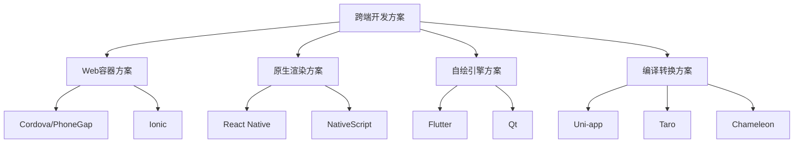

## 跨端开发概述

### 跨端开发的价值

**开发效率提升**:
```javascript
// 传统原生开发
// iOS (Swift/Objective-C) + Android (Java/Kotlin) + Web (JavaScript)
// 需要 3 套代码，3 个团队

// 跨端开发
// 一套代码 -> iOS + Android + Web + 小程序
// 1 个团队，统一技术栈
```

**成本效益分析**:
```
原生开发成本 = iOS开发 + Android开发 + Web开发 + 维护成本
跨端开发成本 = 跨端开发 + 平台适配 + 性能优化

成本节省 ≈ 40-60% (根据项目复杂度)
```

### 主流跨端方案分类



## React Native 深度解析

### 架构原理

**Bridge 架构**:
```javascript
// React Native 架构图
/*
JavaScript Thread    |    Native Thread
                    |
React Components    |    Native Components
       ↓           |           ↑
   JavaScript      |      Native Modules
      Engine       |      (iOS/Android)
       ↓           |           ↑
   Bridge (异步通信) ←→  Native Bridge
*/

// JavaScript 侧
class MyComponent extends React.Component {
  handlePress = () => {
    // 通过 Bridge 调用原生模块
    NativeModules.CameraModule.takePicture()
      .then(result => {
        this.setState({ imageUri: result.uri });
      });
  };
  
  render() {
    return (
      <View style={styles.container}>
        <Text>React Native App</Text>
        <TouchableOpacity onPress={this.handlePress}>
          <Text>Take Photo</Text>
        </TouchableOpacity>
      </View>
    );
  }
}

// Native 侧 (iOS - Objective-C)
@interface CameraModule : NSObject <RCTBridgeModule>
@end

@implementation CameraModule

RCT_EXPORT_MODULE();

RCT_EXPORT_METHOD(takePicture:(RCTPromiseResolveBlock)resolve
                  rejecter:(RCTPromiseRejectBlock)reject) {
  UIImagePickerController *picker = [[UIImagePickerController alloc] init];
  // ... 相机逻辑
  resolve(@{@"uri": imageUri});
}

@end
```

### 性能优化策略

**列表性能优化**:
```javascript
// ❌ 性能问题：大列表使用 ScrollView
const BadList = ({ data }) => (
  <ScrollView>
    {data.map(item => (
      <ExpensiveItem key={item.id} data={item} />
    ))}
  </ScrollView>
);

// ✅ 优化：使用 FlatList 虚拟化
const GoodList = ({ data }) => {
  const renderItem = useCallback(({ item }) => (
    <ExpensiveItem data={item} />
  ), []);
  
  const keyExtractor = useCallback((item) => item.id, []);
  
  return (
    <FlatList
      data={data}
      renderItem={renderItem}
      keyExtractor={keyExtractor}
      // 性能优化配置
      removeClippedSubviews={true}
      maxToRenderPerBatch={10}
      updateCellsBatchingPeriod={50}
      initialNumToRender={10}
      windowSize={10}
      // 预估高度提升性能
      getItemLayout={(data, index) => ({
        length: ITEM_HEIGHT,
        offset: ITEM_HEIGHT * index,
        index,
      })}
    />
  );
};
```

**图片优化**:
```javascript
// 图片缓存和优化
import FastImage from 'react-native-fast-image';

const OptimizedImage = ({ uri, style }) => (
  <FastImage
    style={style}
    source={{
      uri,
      priority: FastImage.priority.normal,
      cache: FastImage.cacheControl.immutable
    }}
    resizeMode={FastImage.resizeMode.cover}
    // 占位图
    defaultSource={require('./placeholder.png')}
    // 加载状态
    onLoadStart={() => console.log('开始加载')}
    onLoad={() => console.log('加载完成')}
    onError={() => console.log('加载失败')}
  />
);
```

### 原生模块开发

**自定义原生模块**:
```javascript
// JavaScript 接口定义
class NativeDeviceInfo {
  static getBatteryLevel(): Promise<number> {
    return NativeModules.DeviceInfoModule.getBatteryLevel();
  }
  
  static getDeviceId(): Promise<string> {
    return NativeModules.DeviceInfoModule.getDeviceId();
  }
}

// iOS 实现 (Swift)
@objc(DeviceInfoModule)
class DeviceInfoModule: NSObject, RCTBridgeModule {
  
  static func moduleName() -> String! {
    return "DeviceInfoModule"
  }
  
  @objc func getBatteryLevel(_ resolve: @escaping RCTPromiseResolveBlock,
                            rejecter reject: @escaping RCTPromiseRejectBlock) {
    UIDevice.current.isBatteryMonitoringEnabled = true
    let batteryLevel = UIDevice.current.batteryLevel
    
    if batteryLevel < 0 {
      reject("BATTERY_ERROR", "无法获取电池电量", nil)
    } else {
      resolve(batteryLevel)
    }
  }
  
  @objc func getDeviceId(_ resolve: @escaping RCTPromiseResolveBlock,
                        rejecter reject: @escaping RCTPromiseRejectBlock) {
    let deviceId = UIDevice.current.identifierForVendor?.uuidString
    resolve(deviceId)
  }
}

// Android 实现 (Java)
public class DeviceInfoModule extends ReactContextBaseJavaModule {
    
    public DeviceInfoModule(ReactApplicationContext reactContext) {
        super(reactContext);
    }
    
    @Override
    public String getName() {
        return "DeviceInfoModule";
    }
    
    @ReactMethod
    public void getBatteryLevel(Promise promise) {
        try {
            IntentFilter ifilter = new IntentFilter(Intent.ACTION_BATTERY_CHANGED);
            Intent batteryStatus = getReactApplicationContext().registerReceiver(null, ifilter);
            
            int level = batteryStatus.getIntExtra(BatteryManager.EXTRA_LEVEL, -1);
            int scale = batteryStatus.getIntExtra(BatteryManager.EXTRA_SCALE, -1);
            
            float batteryPct = level * 100 / (float)scale;
            promise.resolve(batteryPct / 100);
        } catch (Exception e) {
            promise.reject("BATTERY_ERROR", e.getMessage());
        }
    }
}
```

## Flutter 技术深度

### Dart 语言特性

**异步编程模型**:
```dart
// Future 和 async/await
class ApiService {
  static Future<User> fetchUser(String userId) async {
    try {
      final response = await http.get(
        Uri.parse('https://api.example.com/users/$userId'),
        headers: {'Authorization': 'Bearer $token'},
      );
      
      if (response.statusCode == 200) {
        return User.fromJson(json.decode(response.body));
      } else {
        throw ApiException('Failed to load user');
      }
    } catch (e) {
      throw ApiException('Network error: $e');
    }
  }
  
  // Stream 用于实时数据
  static Stream<List<Message>> getMessageStream(String chatId) {
    return FirebaseFirestore.instance
        .collection('chats')
        .doc(chatId)
        .collection('messages')
        .orderBy('timestamp', descending: true)
        .snapshots()
        .map((snapshot) => snapshot.docs
            .map((doc) => Message.fromFirestore(doc))
            .toList());
  }
}

// 使用示例
class UserProfile extends StatefulWidget {
  @override
  _UserProfileState createState() => _UserProfileState();
}

class _UserProfileState extends State<UserProfile> {
  User? user;
  bool isLoading = true;
  String? error;
  
  @override
  void initState() {
    super.initState();
    loadUser();
  }
  
  Future<void> loadUser() async {
    try {
      final userData = await ApiService.fetchUser('123');
      setState(() {
        user = userData;
        isLoading = false;
      });
    } catch (e) {
      setState(() {
        error = e.toString();
        isLoading = false;
      });
    }
  }
  
  @override
  Widget build(BuildContext context) {
    if (isLoading) {
      return Center(child: CircularProgressIndicator());
    }
    
    if (error != null) {
      return Center(child: Text('Error: $error'));
    }
    
    return Column(
      children: [
        Text(user!.name),
        Text(user!.email),
      ],
    );
  }
}
```

### Widget 系统

**自定义 Widget 开发**:
```dart
// 自定义可复用组件
class CustomButton extends StatelessWidget {
  final String text;
  final VoidCallback? onPressed;
  final Color? backgroundColor;
  final Color? textColor;
  final double? width;
  final double? height;
  final bool isLoading;
  
  const CustomButton({
    Key? key,
    required this.text,
    this.onPressed,
    this.backgroundColor,
    this.textColor,
    this.width,
    this.height,
    this.isLoading = false,
  }) : super(key: key);
  
  @override
  Widget build(BuildContext context) {
    return Container(
      width: width,
      height: height ?? 48,
      child: ElevatedButton(
        onPressed: isLoading ? null : onPressed,
        style: ElevatedButton.styleFrom(
          backgroundColor: backgroundColor ?? Theme.of(context).primaryColor,
          foregroundColor: textColor ?? Colors.white,
          shape: RoundedRectangleBorder(
            borderRadius: BorderRadius.circular(8),
          ),
        ),
        child: isLoading
            ? SizedBox(
                width: 20,
                height: 20,
                child: CircularProgressIndicator(
                  strokeWidth: 2,
                  valueColor: AlwaysStoppedAnimation<Color>(
                    textColor ?? Colors.white,
                  ),
                ),
              )
            : Text(text),
      ),
    );
  }
}

// 复杂的自定义 Widget
class AnimatedCounter extends StatefulWidget {
  final int value;
  final Duration duration;
  final TextStyle? textStyle;
  
  const AnimatedCounter({
    Key? key,
    required this.value,
    this.duration = const Duration(milliseconds: 500),
    this.textStyle,
  }) : super(key: key);
  
  @override
  _AnimatedCounterState createState() => _AnimatedCounterState();
}

class _AnimatedCounterState extends State<AnimatedCounter>
    with SingleTickerProviderStateMixin {
  late AnimationController _controller;
  late Animation<double> _animation;
  int _previousValue = 0;
  
  @override
  void initState() {
    super.initState();
    _controller = AnimationController(
      duration: widget.duration,
      vsync: this,
    );
    
    _animation = Tween<double>(
      begin: 0,
      end: widget.value.toDouble(),
    ).animate(CurvedAnimation(
      parent: _controller,
      curve: Curves.easeInOut,
    ));
    
    _controller.forward();
  }
  
  @override
  void didUpdateWidget(AnimatedCounter oldWidget) {
    super.didUpdateWidget(oldWidget);
    
    if (oldWidget.value != widget.value) {
      _previousValue = oldWidget.value;
      _animation = Tween<double>(
        begin: _previousValue.toDouble(),
        end: widget.value.toDouble(),
      ).animate(CurvedAnimation(
        parent: _controller,
        curve: Curves.easeInOut,
      ));
      
      _controller.reset();
      _controller.forward();
    }
  }
  
  @override
  Widget build(BuildContext context) {
    return AnimatedBuilder(
      animation: _animation,
      builder: (context, child) {
        return Text(
          _animation.value.round().toString(),
          style: widget.textStyle ?? Theme.of(context).textTheme.headlineMedium,
        );
      },
    );
  }
  
  @override
  void dispose() {
    _controller.dispose();
    super.dispose();
  }
}
```

### 状态管理

**Provider 模式**:
```dart
// 数据模型
class CounterModel extends ChangeNotifier {
  int _count = 0;
  
  int get count => _count;
  
  void increment() {
    _count++;
    notifyListeners();
  }
  
  void decrement() {
    _count--;
    notifyListeners();
  }
  
  void reset() {
    _count = 0;
    notifyListeners();
  }
}

// 应用入口
class MyApp extends StatelessWidget {
  @override
  Widget build(BuildContext context) {
    return MultiProvider(
      providers: [
        ChangeNotifierProvider(create: (_) => CounterModel()),
        ChangeNotifierProvider(create: (_) => UserModel()),
        ChangeNotifierProvider(create: (_) => ThemeModel()),
      ],
      child: MaterialApp(
        home: HomePage(),
      ),
    );
  }
}

// 使用 Provider
class CounterWidget extends StatelessWidget {
  @override
  Widget build(BuildContext context) {
    return Consumer<CounterModel>(
      builder: (context, counter, child) {
        return Column(
          children: [
            Text('Count: ${counter.count}'),
            Row(
              mainAxisAlignment: MainAxisAlignment.spaceEvenly,
              children: [
                ElevatedButton(
                  onPressed: counter.decrement,
                  child: Text('-'),
                ),
                ElevatedButton(
                  onPressed: counter.increment,
                  child: Text('+'),
                ),
                ElevatedButton(
                  onPressed: counter.reset,
                  child: Text('Reset'),
                ),
              ],
            ),
          ],
        );
      },
    );
  }
}
```

## Uni-app 生态分析

### 多端编译原理

**编译流程**:
```javascript
// uni-app 编译过程
/*
Vue SFC 源码
    ↓
编译器解析 (template, script, style)
    ↓
平台适配转换
    ├── 微信小程序 (wxml, js, wxss)
    ├── 支付宝小程序 (axml, js, acss)  
    ├── H5 (html, js, css)
    ├── App (nvue, js, css)
    └── 快应用 (ux, js, css)
*/

// 条件编译示例
<template>
  <view class="container">
    <!-- #ifdef MP-WEIXIN -->
    <button open-type="getUserInfo" @getuserinfo="getUserInfo">
      微信授权登录
    </button>
    <!-- #endif -->
    
    <!-- #ifdef MP-ALIPAY -->
    <button @tap="getAuthCode">
      支付宝授权登录
    </button>
    <!-- #endif -->
    
    <!-- #ifdef H5 -->
    <button @click="webLogin">
      网页登录
    </button>
    <!-- #endif -->
    
    <!-- #ifdef APP-PLUS -->
    <button @click="appLogin">
      App登录
    </button>
    <!-- #endif -->
  </view>
</template>

<script>
export default {
  methods: {
    // #ifdef MP-WEIXIN
    getUserInfo(e) {
      console.log('微信用户信息', e.detail.userInfo);
    },
    // #endif
    
    // #ifdef MP-ALIPAY
    getAuthCode() {
      my.getAuthCode({
        scopes: 'auth_user',
        success: (res) => {
          console.log('支付宝授权码', res.authCode);
        }
      });
    },
    // #endif
    
    // #ifdef H5
    webLogin() {
      // Web端登录逻辑
      window.location.href = '/login';
    },
    // #endif
    
    // #ifdef APP-PLUS
    appLogin() {
      // App端登录逻辑
      plus.oauth.getServices((services) => {
        // 第三方登录
      });
    }
    // #endif
  }
};
</script>

<style>
.container {
  padding: 20px;
}

/* #ifdef H5 */
.container {
  max-width: 750px;
  margin: 0 auto;
}
/* #endif */

/* #ifdef MP */
.container {
  background-color: #f5f5f5;
}
/* #endif */
</style>
```

### API 统一封装

**跨平台 API 封装**:
```javascript
// 统一的网络请求封装
class HttpService {
  static baseURL = 'https://api.example.com';
  
  static request(options) {
    return new Promise((resolve, reject) => {
      // 统一请求配置
      const config = {
        url: this.baseURL + options.url,
        method: options.method || 'GET',
        data: options.data,
        header: {
          'Content-Type': 'application/json',
          ...this.getAuthHeaders(),
          ...options.header
        },
        timeout: options.timeout || 10000,
        success: (res) => {
          if (res.statusCode === 200) {
            resolve(res.data);
          } else {
            reject(new Error(`HTTP ${res.statusCode}: ${res.data.message}`));
          }
        },
        fail: (err) => {
          reject(new Error(`网络请求失败: ${err.errMsg}`));
        }
      };
      
      uni.request(config);
    });
  }
  
  static getAuthHeaders() {
    const token = uni.getStorageSync('token');
    return token ? { 'Authorization': `Bearer ${token}` } : {};
  }
  
  // GET 请求
  static get(url, params) {
    return this.request({
      url: params ? `${url}?${this.buildQuery(params)}` : url,
      method: 'GET'
    });
  }
  
  // POST 请求
  static post(url, data) {
    return this.request({
      url,
      method: 'POST',
      data
    });
  }
  
  static buildQuery(params) {
    return Object.keys(params)
      .map(key => `${encodeURIComponent(key)}=${encodeURIComponent(params[key])}`)
      .join('&');
  }
}

// 统一的存储封装
class StorageService {
  static setItem(key, value) {
    try {
      uni.setStorageSync(key, JSON.stringify(value));
      return true;
    } catch (e) {
      console.error('存储失败:', e);
      return false;
    }
  }
  
  static getItem(key, defaultValue = null) {
    try {
      const value = uni.getStorageSync(key);
      return value ? JSON.parse(value) : defaultValue;
    } catch (e) {
      console.error('读取失败:', e);
      return defaultValue;
    }
  }
  
  static removeItem(key) {
    try {
      uni.removeStorageSync(key);
      return true;
    } catch (e) {
      console.error('删除失败:', e);
      return false;
    }
  }
  
  static clear() {
    try {
      uni.clearStorageSync();
      return true;
    } catch (e) {
      console.error('清空失败:', e);
      return false;
    }
  }
}

// 统一的导航封装
class NavigationService {
  static navigateTo(url, params = {}) {
    const query = Object.keys(params).length > 0 
      ? '?' + new URLSearchParams(params).toString()
      : '';
    
    uni.navigateTo({
      url: url + query,
      fail: (err) => {
        console.error('导航失败:', err);
      }
    });
  }
  
  static redirectTo(url, params = {}) {
    const query = Object.keys(params).length > 0 
      ? '?' + new URLSearchParams(params).toString()
      : '';
    
    uni.redirectTo({
      url: url + query,
      fail: (err) => {
        console.error('重定向失败:', err);
      }
    });
  }
  
  static switchTab(url) {
    uni.switchTab({
      url,
      fail: (err) => {
        console.error('切换Tab失败:', err);
      }
    });
  }
  
  static navigateBack(delta = 1) {
    uni.navigateBack({
      delta,
      fail: (err) => {
        console.error('返回失败:', err);
      }
    });
  }
}
```

## Taro 框架解析

### 多端适配机制

**编译时适配**:
```javascript
// Taro 组件开发
import { Component } from '@tarojs/taro';
import { View, Text, Button, Image } from '@tarojs/components';
import './index.scss';

class ProductCard extends Component {
  static defaultProps = {
    product: {},
    onAddToCart: () => {}
  };
  
  handleAddToCart = () => {
    const { product, onAddToCart } = this.props;
    onAddToCart(product);
  };
  
  render() {
    const { product } = this.props;
    
    return (
      <View className="product-card">
        <Image 
          className="product-image"
          src={product.imageUrl}
          mode="aspectFill"
        />
        <View className="product-info">
          <Text className="product-name">{product.name}</Text>
          <Text className="product-price">¥{product.price}</Text>
          <Button 
            className="add-button"
            onClick={this.handleAddToCart}
          >
            加入购物车
          </Button>
        </View>
      </View>
    );
  }
}

export default ProductCard;
```

**运行时适配**:
```javascript
// 平台差异处理
import Taro from '@tarojs/taro';

class PlatformService {
  // 获取系统信息
  static getSystemInfo() {
    return new Promise((resolve) => {
      Taro.getSystemInfo({
        success: (res) => {
          resolve({
            platform: res.platform,
            system: res.system,
            version: res.version,
            screenWidth: res.screenWidth,
            screenHeight: res.screenHeight,
            statusBarHeight: res.statusBarHeight,
            safeArea: res.safeArea
          });
        }
      });
    });
  }
  
  // 平台特定功能
  static async showActionSheet(options) {
    if (Taro.getEnv() === Taro.ENV_TYPE.WEAPP) {
      // 微信小程序
      return Taro.showActionSheet({
        itemList: options.itemList,
        success: options.success,
        fail: options.fail
      });
    } else if (Taro.getEnv() === Taro.ENV_TYPE.WEB) {
      // H5 环境，使用自定义实现
      return this.showWebActionSheet(options);
    }
  }
  
  static showWebActionSheet(options) {
    // H5 自定义 ActionSheet 实现
    const modal = document.createElement('div');
    modal.className = 'action-sheet-modal';
    
    const sheet = document.createElement('div');
    sheet.className = 'action-sheet';
    
    options.itemList.forEach((item, index) => {
      const button = document.createElement('button');
      button.textContent = item;
      button.onclick = () => {
        options.success && options.success({ tapIndex: index });
        document.body.removeChild(modal);
      };
      sheet.appendChild(button);
    });
    
    modal.appendChild(sheet);
    document.body.appendChild(modal);
  }
}
```

## 性能对比分析

### 启动性能

```javascript
// 性能测试数据 (仅供参考)
const performanceData = {
  startupTime: {
    'React Native': '2.5s',
    'Flutter': '1.8s', 
    'Uni-app': '1.2s',
    'Taro': '1.5s',
    'Native': '0.8s'
  },
  
  memoryUsage: {
    'React Native': '45MB',
    'Flutter': '35MB',
    'Uni-app': '25MB', 
    'Taro': '30MB',
    'Native': '20MB'
  },
  
  packageSize: {
    'React Native': '8-15MB',
    'Flutter': '4-8MB',
    'Uni-app': '2-5MB',
    'Taro': '3-6MB',
    'Native': '1-3MB'
  }
};

// 性能优化建议
class PerformanceOptimizer {
  // React Native 优化
  static optimizeReactNative() {
    return {
      // 1. 启用 Hermes 引擎
      enableHermes: true,
      
      // 2. 使用 FlatList 替代 ScrollView
      useFlatList: true,
      
      // 3. 图片优化
      imageOptimization: {
        useWebP: true,
        enableCaching: true,
        resizeMode: 'cover'
      },
      
      // 4. Bundle 分包
      bundleSplitting: true,
      
      // 5. 原生模块优化
      nativeModules: {
        lazyLoading: true,
        caching: true
      }
    };
  }
  
  // Flutter 优化
  static optimizeFlutter() {
    return {
      // 1. 使用 const 构造函数
      useConstConstructors: true,
      
      // 2. ListView.builder 替代 ListView
      useListViewBuilder: true,
      
      // 3. 避免不必要的 build
      avoidUnnecessaryBuilds: true,
      
      // 4. 使用 RepaintBoundary
      useRepaintBoundary: true,
      
      // 5. 代码分割
      codeSplitting: true
    };
  }
}
```

### 开发效率对比

```javascript
// 开发效率评估
const developmentEfficiency = {
  learningCurve: {
    'React Native': 'Medium', // 需要学习 React + 原生知识
    'Flutter': 'High',        // 需要学习 Dart 语言
    'Uni-app': 'Low',         // 基于 Vue，学习成本低
    'Taro': 'Low'             // 基于 React，但语法简化
  },
  
  developmentSpeed: {
    'React Native': 'Fast',
    'Flutter': 'Fast', 
    'Uni-app': 'Very Fast',   // 一套代码多端运行
    'Taro': 'Fast'
  },
  
  debuggingExperience: {
    'React Native': 'Good',   // Flipper, Chrome DevTools
    'Flutter': 'Excellent',  // Flutter Inspector
    'Uni-app': 'Good',       // HBuilderX 集成调试
    'Taro': 'Good'           // Chrome DevTools
  },
  
  communitySupport: {
    'React Native': 'Excellent', // Facebook 支持，社区活跃
    'Flutter': 'Excellent',     // Google 支持，快速发展
    'Uni-app': 'Good',          // DCloud 支持，中文社区
    'Taro': 'Good'              // 京东支持，开源社区
  }
};
```

## 选型建议

### 技术选型决策树

```javascript
class TechSelectionGuide {
  static selectTechnology(requirements) {
    const {
      teamSkills,      // 团队技能
      projectType,     // 项目类型
      performanceReq,  // 性能要求
      platforms,       // 目标平台
      timeline,        // 开发周期
      budget          // 预算
    } = requirements;
    
    // 高性能要求 + 复杂UI
    if (performanceReq === 'high' && projectType === 'complex') {
      if (teamSkills.includes('dart')) {
        return 'Flutter';
      } else if (teamSkills.includes('react')) {
        return 'React Native';
      }
    }
    
    // 多端发布 + 快速开发
    if (platforms.length >= 3 && timeline === 'short') {
      if (teamSkills.includes('vue')) {
        return 'Uni-app';
      } else if (teamSkills.includes('react')) {
        return 'Taro';
      }
    }
    
    // 小程序为主
    if (platforms.includes('miniprogram') && platforms.length <= 2) {
      return teamSkills.includes('vue') ? 'Uni-app' : 'Taro';
    }
    
    // 原生性能要求
    if (performanceReq === 'native') {
      return 'Native Development';
    }
    
    return 'React Native'; // 默认推荐
  }
  
  static getRecommendation(projectType) {
    const recommendations = {
      'e-commerce': {
        primary: 'Uni-app',
        reason: '电商项目需要快速多端发布，Uni-app 生态完善',
        alternatives: ['Taro', 'Flutter']
      },
      
      'social': {
        primary: 'React Native',
        reason: '社交应用重视用户体验，RN 性能和生态较好',
        alternatives: ['Flutter']
      },
      
      'game': {
        primary: 'Flutter',
        reason: '游戏需要高性能渲染，Flutter 自绘引擎优势明显',
        alternatives: ['Native']
      },
      
      'enterprise': {
        primary: 'Uni-app',
        reason: '企业应用重视开发效率和维护成本',
        alternatives: ['Taro']
      },
      
      'media': {
        primary: 'React Native',
        reason: '媒体应用需要丰富的原生功能支持',
        alternatives: ['Flutter']
      }
    };
    
    return recommendations[projectType] || recommendations['enterprise'];
  }
}

// 使用示例
const projectRequirements = {
  teamSkills: ['javascript', 'vue'],
  projectType: 'e-commerce',
  performanceReq: 'medium',
  platforms: ['ios', 'android', 'h5', 'miniprogram'],
  timeline: 'short',
  budget: 'medium'
};

const recommendation = TechSelectionGuide.selectTechnology(projectRequirements);
console.log('推荐技术栈:', recommendation);
```

## 总结

### 各方案优劣势总结

**React Native**:
- ✅ 接近原生性能，生态丰富，Facebook 支持
- ❌ 学习成本较高，需要原生开发知识

**Flutter**:
- ✅ 高性能自绘引擎，优秀的开发体验，Google 支持  
- ❌ Dart 语言学习成本，包体积较大

**Uni-app**:
- ✅ 一套代码多端运行，Vue 生态，中文文档完善
- ❌ 性能不如原生渲染方案，平台差异需要适配

**Taro**:
- ✅ React 语法，多端支持，京东团队维护
- ❌ 编译复杂度高，部分高级特性受限

### 最佳实践建议

1. **技术选型**: 根据团队技能、项目需求和时间预算综合考虑
2. **性能优化**: 无论选择哪种方案，都需要关注性能优化
3. **平台适配**: 做好平台差异处理和兼容性测试
4. **团队培训**: 投入时间学习选定技术栈的最佳实践
5. **持续优化**: 建立性能监控和持续优化机制

跨端开发是移动开发的重要趋势，选择合适的技术方案能够显著提升开发效率和降低维护成本。